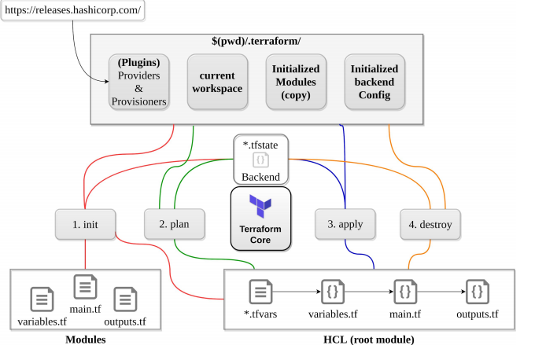
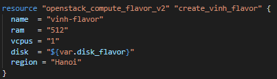
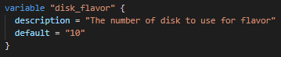
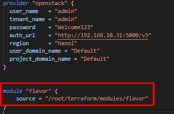

# Mục lục 
1. Terraform là gì?
2. IaC là gì?
3. Tại sao nên sử dụng Terraform
4. Cách thức hoạt động của Terraform
5. So sánh Terraform

# 1. Terraform là gì 

- Terraform là một phần mêm công mã nguồn mở "Infrastructure as Code", được viết bằng ngôn ngữ Golang. được tạo ra và phát triển  bởi HashiCorp.

- Terraform là một công cụ coding dạng khai báo, Terraform cho phép các lập trình viên sử dụng ngôn ngữ cấu hình bậc cao gọi là HCL ( HashiCorp Configuration Language ) để diễn tả trạng thái mong muốn cuối cùng của các ứng dụng chạy trên trên hạ tầng cloud. Nó đưa ra một kết hoạch để đạt được đến trạng thái cuối và thực thi các kế hoạch cho việc khởi tạo hạ tầng.

- Vì Terraform sử dụng cú pháo đơn giản, có thể khởi tạo hạ tầng trên mọi môi trường cloud. Có thể sử dụng an toàn và hiệu quả cho việc tại khởi tạo các hạ tầng đó khi có sự thay đổi về cấu hình.

- Terraform có thể quản lý các hạ tầng public-clouds như Amazon Web Services, Microsoft Azure, và Google Cloud, hoặc các private-cloud như VMWarevSphere, Openstack hoặc CloudStack.

- Terraform rất phù hợp để sử dụng trên môi trường hybird cloud và multicloud.

# 2. IaC là gì?

- Để hiểu rõ hơn về các lợi ích Terraform mang lại, trước hết hãy tìm hiểu về Infratructure as Code ( IaC ). IaC cho phép các lập trình viên có thể mô tả hạ tầng bằng code để  có thể khởi tạo hạ tầng tự động, nhanh hơn, có thể lặp lại. có thể hiểu như CI/CD (Continuous integration, continuous developer ).

- Những lợi ích của IaC:
    - Improve speed (Cải thiện tốc độ): Việc tự động hóa sẽ luôn nhanh hơn việc cài đặt điều hướng theo kiểu thủ công 
    
    - Improve reliability ( Cải thiệu sự tin cậy ): Nếu hạ tầng của bạn lớn, nếu cài đặt thủ công khi đó sẽ xảy ra các vấn đề như thiếu, sai sót cấu hình các services. Với IaC các tài nguyên, dịch vụ luôn được khởi tạo và cấu hình chính xác và đồng bộ với những đã khai báo
    
    - Prevent configuration drift (Ngăn ngừa việc cấu hình bị trôi): Cấu hình bị trôi sẽ xảy ra khi những cấu hình trên môi trường bạn đã khởi tạo không còn phù hợp và khớp với cấu hình trên môi trường thực tế.

    - Support experimentation, testing, and optimization( Hỗ trợ thử nghiệm và tối ưu ): Bởi vì IaC thực hiện việc khởi tạo một hạ tầng mới rất nhanh và dễ dàng nên bạn có thể thực hiện đưa hạ tầng ấy đưa qua các khâu test kiểm thử mà không tốn quá nhiều tài nguyên và thời gian, sau đó bạn có thể nhanh chóng scale up hệ thống hạ tầng ấy cung cấp dịch vụ.

# 3. Vì sao nên sử dụng Terraform

- Open source: Terraform được hỗ trợ và đóng góp bởi cộng đồng lớn đã phát triển các plugins cho platform này. Bất kể bạn sử dịng nhà cung cấp cloud nào, bạn cũng có thể dễ dàng tìm các plugins, extensions, và sự hỗ trợ. Nhờ đó mà Terraform phát triển rất nhanh và mang lại nhiều tiện lợi

- Platform agnostic: Bạn có thể sử dụng Terraform tương tác với rất nhiều nhà cung cấp Cloud.

- Immutable infrastructure: Phần lớn các công cụ IaC được dùng để phục vụ cho sự thay đổi của hạ tầng hệ thống, tức là hệ thống sẽ phải được thay đổi để thích nghi với sự nâng cấp về phiên bản của middleware hoặc cũng có thể là thêm các máy chủ lưu trữ. Việc nguy hiểm nhất khi tác động đến hạ tầng như vậy là việc các cấu hình bị drift. Terraform quy định một cơ sở hạ tầng bất biến, tức là đối với việc môi trường bị thay đổi, thì các cấu hình hiện tại sẽ được thay thế bằng các cấu hình phù hợp  cho cụm hạ tầng mới hơn. và điều làm cho Terraform trở nên đặc biệt là nó sẽ lưu các cấu hình của hệ thống cũ lại và luôn sẵn sàng để được rollbacks khi cần thiết.

# 4. Cách thức hoạt động của Terraform

## 4.1. Terraform configuration files
- Ngôn ngữ HCL (HashiCorp Configuration Language)
- Một tập hợp các file với nội dung định nghĩa cấu trúc hệ thống

    

    ( Thực hiện khởi tạo flavor trên hệ thống OPS )

### 4.1.1 Terraform State file
- File ghi lại trạng thái của hệ thống mỗi khi Terraform áp dụng thay đổi lên hệ thống
- Là file quan trọng cần được backup thường xuyên
- Không nên sửa thủ công mà thông qua 1 SCM
- State lock: trong lúc Terraform đang thực thi thay đổi hoặc khởi tạo lên provider thì file này xuất hiện với mục đích ngăn không cho tiến trình terraform khác ghi lên state file để tránh dẫn đến conflic.

### 4.1.2 Terraform vars file

- Thay vì việc phải chỉnh sửa các giá trị trong từng file code thì ta sẽ đưa tất cả các giá trị được phân tán nhiều nơi ra ngoài thành một biến:
    - variables.tf : file khai báo danh sách các biến vào kiểu dữ liệu

        
    
    - example.tfvars : File khai báo các giá trị của các biến tương ứng trong variables.tf

### 4.1.3 Terraform module
- Tái sử dụng các config file
- Thường được sử dụng khi tạo nhiều resource có cấu hình tương tự nhau 
- Có thể lưu trữ các module riêng biệt, các project khác nhau cùng tham chiếu và sử dụng
- Cách thức gọi một module

    

## 4.2. Terraform Backend
- Là nơi lưu state file
- Có thể lưu dưới localhost ( local state)
- Có thể lưu trên các object storage service như S#, GCS, Terraform cloud, swift (remote state )
- Thông thưởng khi nhiều người chỉnh sửa state file thì nên được lưu trên object storage service để được đồng bộ

## 4.3 Terraform core

### 4.3.1 Init

- Dùng để chuẩn bị cho việc chạy terraform, khởi tạo backend và kiểm tra cú pháp

- Thường sử dụng sau khi đã viết xong code lần đầu, mới clone code về SCM hoặc thay đổi, khai báo module

- Việc chạy ini này sẽ không bị ảnh hưởng bởi state file

### 4.3.2 Plan

- Hiển thị những thay đổi dự kiến sẽ được thực hiện trên provider, vậy nên khi chạy bước này phải kiểm tra để xác định rõ những thay đổi được áp dụng trên provider

### 4.3.3 Apply

- Sẽ thực hiện chạy và deploy các thay đổi lên provider
- Terraform sẽ đọc nội dung state và config file, so sánh lần chạy hiện tại với lần chạy trước đó, từ đó ẽ đưa ra danh sách thay đổi áp dụng lên hệ thống

### 4.3.4 Destroy

- Xóa toàn bộ hệ thống đã được được khai báo và tạo ra bởi terraform

### 4.4 Terraform Workspace

- Được sử dụng để tạo nhiều môi trường khác nhau từ một project ( development, stagging, production)
- Mỗi một workspace sẽ thực hiện đọc ghi lên một state file riêng biệt
